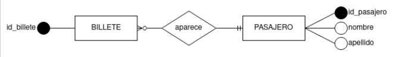
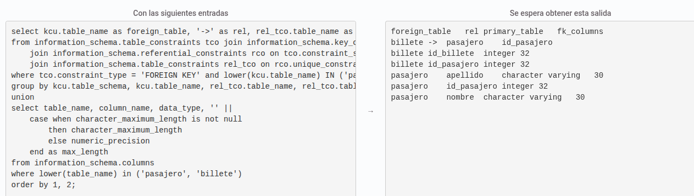

A partir del diagrama conceptual que se adjunta, crea las tablas resultantes del modelo, teniendo en cuenta que los contenidos de los atributos serán::

id_billete: número entero
id_pasajero: número entero
nombre: hasta 30 caracteres
apellido: hasta 30 caracteres
Esa relación no generará valores NULL, ya que la participación de la entidad que participa con cardinalidad 1 es total.

Además, deberás incorporar las siguientes restricciones:

Las claves primarias y ajenas de las tablas. El nombre de las claves ajenas será el mismo que el que tienen en la tabla a la que referencian.
Todos los datos son obligatorios.

