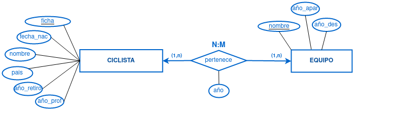
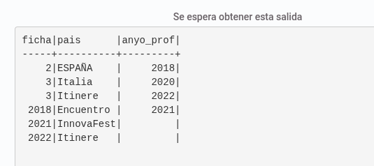

A partir del diagrama lógico que se adjuunta realizar las siguientes operaciones en el JuezLTI:

Crea las tablas resultantes del modelo anterior, teniendo en cuenta que los contenidos de los atributos serán:

ficha: número entero
fecha_nac : fecha
nombre: hasta 50 caracteres
pais: hasta 30 caracteres
anyo_retiro: solo el año
anyo_prof: solo el año
anyo: solo el año
nombre: hasta 100 caracteres
anyo_apar: solo el año
anyo_des: solo el año
Además, deberás incorporar las siguientes restricciones:

Las claves primarias y ajenas de las tablas. El nombre de las claves ajenas será el mismo que el que tiene en la tabla a la que referencian.
Los ciclistas pueden volver a un equipo del que previamente habían salido, aunque solo se guarda el año en el que comienza su pertenencia al equipo en cada periodo (se guarda un histórico de las pertenencias de los ciclistas a los equipos)
El país por defecto es ESPAÑA, y se guardará en mayúsculas
Todos los datos son obligatorios excepto el año del retiro y año de desaparición
Solo se admitirán ciclistas profesionalizados a partir del 2015.
Con las siguientes entradas:
INSERT INTO ciclista (ficha,fecha_nac,nombre)
	VALUES (1,'2001-10-02','Pepe');
INSERT INTO ciclista (ficha,fecha_nac,nombre,anyo_retiro,anyo_prof)
	VALUES (2,'2000-01-12','Juana',2019,2018);
INSERT INTO ciclista (ficha,fecha_nac,nombre,pais,anyo_retiro,anyo_prof)
	VALUES (3,'1999-03-22','Juan','Italia',NULL,2020);
INSERT INTO ciclista (ficha,fecha_nac,nombre,pais,anyo_retiro,anyo_prof, pertenece)
	VALUES (4,'1999-03-22','Juan','Italia',NULL,2020, 2018);
INSERT INTO equipo (nombre,anyo_apar)
	VALUES ('Itinere',2022);
INSERT INTO ciclista (ficha,fecha_nac,nombre,pais,anyo_retiro,anyo_prof, equipo)
	VALUES (5,'1999-03-22','Juan','Italia',NULL,2020, 2018, 'Itinere');
INSERT INTO equipo (nombre,anyo_apar,anyo_des)
	VALUES ('Encuentro',2018,2021);
INSERT INTO equipo (nombre,anyo_apar)
	VALUES ('ImaginaUnaEmpresaDiferenteImaginaUnaEmpresaDiferenteImaginaUnaEmpresaDiferenteImaginaUnaEmpresaDiferente',2019);
INSERT INTO equipo (nombre,anyo_apar)
	VALUES ('InnovaFest',2021);
INSERT INTO equipo (nombre)
	VALUES ('ImaginaUnaEmpresaDiferente');
INSERT INTO equipo (nombre,anyo_apar)
	VALUES ('InnovaFest',2022);
INSERT INTO pertenece (ficha,nombre)
	VALUES (1,'Itinere');
INSERT INTO pertenece (ficha,nombre,anyo)
	VALUES (2,'Itineres',2022);
INSERT INTO pertenece (ficha,nombre,anyo)
	VALUES (21,'Itinere',2022);
INSERT INTO pertenece (ficha,nombre,anyo)
	VALUES (3,'Itinere',2022);
INSERT INTO pertenece (ficha,nombre,anyo)
	VALUES (3,'Itinere',2022);
INSERT INTO ciclista (ficha,fecha_nac,nombre,pais,anyo_retiro,anyo_prof, pertenece)
	VALUES (6,'1999-03-22','Juan','Italia',NULL,2020, 2018);
INSERT INTO ciclista (ficha,fecha_nac,nombre,pais,anyo_retiro,anyo_prof, equipo)
	VALUES (7,'1999-03-22','Juan','Italia',NULL,2020, 'Itinere');

select ficha, pais, anyo_prof  from CICLISTA
union
select anyo_apar, nombre, anyo_des from equipo
union
select ficha , nombre, anyo from pertenece
order by 1,2;

