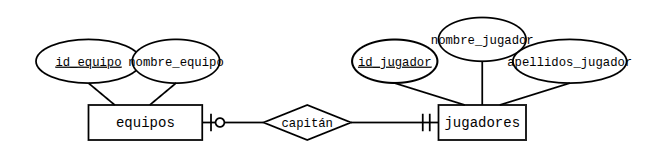
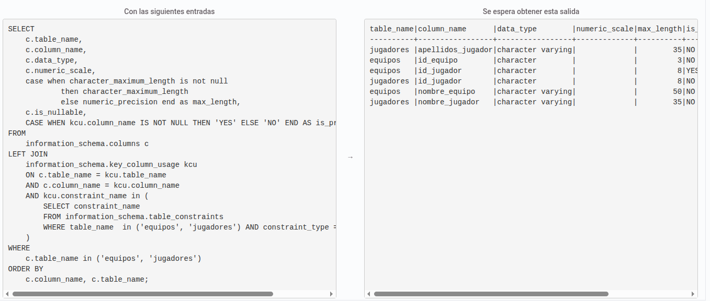

A partir del diagrama conceptual que se adjunta, crea las tablas resultantes del modelo, teniendo en cuenta que los contenidos de los atributos serán:

id_equipo: Cadena de 3 caracteres que actúa como identificador único (ejemplo: 'RM1')
nombre_equipo: Cadena de hasta 50 caracteres
id_jugador: Cadena de 8 caracteres que actúa como identificador único
nombre_jugador: Cadena de hasta 35 caracteres
apellidos_jugador: Cadena de hasta 35 caracteres
Ten en cuenta que la relación puede generar valores NULL, ya que la mayoríía de las entidades de jugadores no participan en la relación.

Además, deberás incorporar las siguientes restricciones:

Las claves primarias y ajenas de las tablas. El nombre de las claves ajenas será el mismo que el que tienen en la tabla a la que referencian.
Todos los datos son obligatorios.

