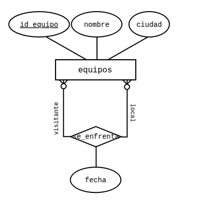
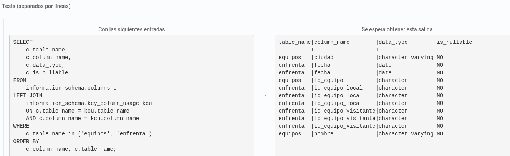

A partir del diagrama conceptual que se adjunta, crea las tablas resultantes del modelo, teniendo en cuenta que los contenidos de los atributos serán:

id_equipo: (id_equipo_local, id_equipo_visitante)Cadena de 3 caracteres que actúa como identificador único (ejemplo: 'RM1')
nombre: Cadena de hasta 50 caracteres
ciudad: Cadena de hasta 35 caracteres
Además, deberás incorporar las siguientes restricciones:

Las claves primarias y ajenas de las tablas. El nombre de las claves ajenas será el mismo que el que tienen en la tabla a la que referencian.

Dos equipos se pueden enfrentar varias veces, en fechas distintas, participando indistintamente como local y como visitante.

Todos los datos son obligatorios

