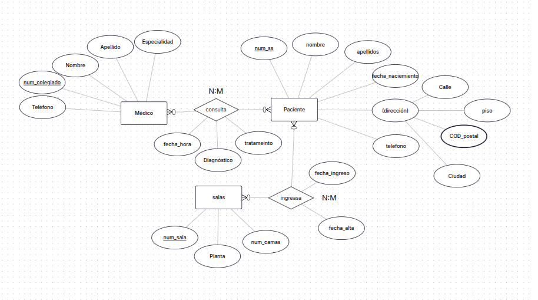

Ejercicio 5: Sistema de Gestión de Hospital
Un hospital necesita gestionar la información de sus pacientes, médicos y consultas.
Los médicos tienen: número de colegiado, nombre, apellidos, especialidad y teléfono.
Los pacientes tienen: número de seguridad social, nombre, apellidos, fecha de nacimiento, dirección y teléfono.
Un médico realiza consultas a varios pacientes. Un paciente puede ser atendido por varios médicos en diferentes consultas. De cada consulta se registra: fecha y hora, diagnóstico y tratamiento.
El hospital tiene salas de hospitalización con: número de sala, planta y número de camas.
Un paciente puede ingresar en diferentes salas a lo largo del tiempo. Una sala puede tener varios pacientes ingresados simultáneamente. De cada ingreso se guarda: fecha de ingreso y fecha de alta.

